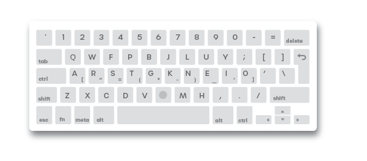

<h1 style="margin-left:-300px">
  </img>
</h1>

## Overview

This is my custom variant of the Colemak keyboard layout. Inspired by Programmer Dvorak, the number keys have been flipped with commonly used symbols in programming. The more frequent symbols such as parenthesis are located closer to the middle so they can be reached by the stronger fingers. 

The layout is optimal for Python, but other programming languages should not be too much of an adjustment. The obfuscated code used to generate the key frequencies and an accompanying jupyter notebook are provided if you wish to tailor the layout to your own code.

## Quirks

I didn't want to sacrifice my control key (caps lock) so it works as both a backspace and a control key. It might take some time getting used to. Also `shift+backspace` is now equivalent to `ctrl + backspace`. The former control key is mapped to the escape key.

## Layout

</img>

## Usage

Run `curl [aru.ai/keys](http://aru.ai/keys) > bash` to quickly download it to your computer or you can manually clone the git repository. Place the `.customMap` file in a location that runs on start-up, preferably `here`. Linux distributions and MacOS come preinstalled with Colemak, but if you're on Windows, the suggested thing to do would be to get a better operating system.
