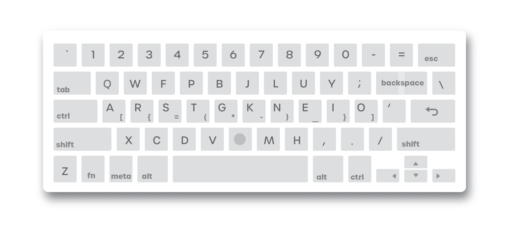

<p align="center">
    
</p>

# Overview

QWERTY was required for the typewriter age, but today it is outmoded, cruel, and taxing. For programmers in particular, who spend much of their lives over the keyboard, it’s a grim fact that some of their most common symbols are marginalized to the fringes of the keyboard. Frustrated with these inequities, I designed Programmer Colemak to make typing more ergonomic, comfortable, and enjoyable for programmers.

</img>

# Design

Programmer Colemak is based on the [Colemak](https://colemak.com/) keyboard layout; in particular, a variation known as [Colemak-DH](https://colemakmods.github.io/mod-dh/). Common programming symbols are made available on the home row, which is where your fingers naturally rest, while pressing the `◯` key in the fourth row (the "super" key). 

The home row is arranged so such that the most frequent symbols are accessible by the stronger fingers (ex: the `(` and `)` keys and the index fingers). Key frequencies were derived from a mix of common open-source projects, such that no programming language was favored over another. The chart below is from [here](http://xahlee.info/comp/computer_language_char_distribution.html).


Some other notable changes from Colemak: the backspace key is shifted so that it’s within range of the pinky, the caps lock key is replaced by control, and Z occupies the location of the former control key. The table below summarizes the changes Programmer-Colemak makes to Colemak-DH.

**Differences from Colemak-DH**
| Old Keys |      New Keys     | Notes |
|------------|----------------------|-----------
| `<caps lock>`    |  `<ctrl>`         | `<ctrl>` is far more useful.
| `<ctrl>`         |  `z`              | Z key is [rarely used](https://en.wikipedia.org/wiki/Letter_frequency)
| `<backspace>`    | `<escape>`        | For vim users
| `[` `]`          |  `<backspace>`    | Two keys merged to make new `<backspace>`
| `m`              |   `k`             | `m` moved to better position
| `k`              |   `m`             | `m` is more common than `k`
| `z`              | `◯`              | "Super" modifier key


# Learning

Learning a new keyboard layout can be intimidating, but the return on investment is well worth it. I made the switch myself a few months after creating this layout and haven’t looked back since. It's also been much better for my hands.

Perhaps the fastest way to learn is to go cold-turkey (if possible). Switch to the new layout and just do your everyday work. The first few hours will be excruciatingly slow, the first few days ponderous, and the first few weeks difficult, but within a month, you should become comfortable with a layout that will benefit you for a lifetime.

The easier approach (and the least disruptive one) is to learn Colemak first using [Tarmak](https://forum.colemak.com/topic/1858-learn-colemak-in-steps-with-the-tarmak-layouts/) (gradual shift from QWERTY) and then switch to Programmer Colemak.


# Installation

## Linux

### Terminal

(`/linux/loadkeys`)

*This is if you’re not using a desktop environment (e.g. just a raw terminal). This
version may be missing a few features.*

Run `loadkeys linux/prog_ck.loadkeys` and the keyboard should be activated.
See [loadkeys](https://man7.org/linux/man-pages/man1/loadkeys.1.html) for usage.

### X Windowing System
(`/linux/xkb`)

If you’re using a desktop environment (e.g. Gnome, KDE, or Xfce), then you’re likely using the [X Windowing System](http://www.opengroup.org/tech/desktop/x-window-system/) (run `echo $XDG_SESSION_TYPE` to check). X uses the X Keyboard Extension (xkb) for keyboard layouts. You can
install Programmer Colemak with two methods.

**Temporary**

To install temporarily (resets on restart), simply run `xkbcomp prog_ck_keymap.xkb $DISPLAY` and the keyboard should be activated. 
You may safely ignore any errors when running the command.

**Full**

The configuration directory for keymaps varies by distribution (for Arch, it is `/usr/share/X11/xkb/symbols/`). Inside the directory, append to the `us` file the contents of `prog_ck_symbols.xkb`.

Then, add the following lines to `/usr/share/X11/xkb/rules/evdev.xml` (may be at a different location) below  the first instance of `<name>us</name>`.

```
<variant>
    <configItem>
        <name>programmer-colemak</name>
            <description>Programmer Colemak</description>
        </configItem>
    </variant>
<variant>
```

From here, you can use your desktop environment’s gui keyboard tool to load “Programmer Colemak”.

If you’re interested in learning more, see the [arch wiki](https://wiki.archlinux.org/title/X_keyboard_extension) and [this guide](https://www.charvolant.org/doug/xkb/html/index.html).


### Wayland

Not supported yet.

## Windows

There are two installations provided for Windows, which require [AutoHotKey](https://www.autohotkey.com) and (only for full installation) [Sharpkeys](https://github.com/randyrants/sharpkeys).

### Lite installation
(`/windows/lite`)

This method does not modify the registry, but the `ctrl` and `caps lock` keys will not be modified and the keyboard may not work in privileged applications (such as powershell). 
Install by running `prog_ck.ahk` with AutoHotkey.

### Full installation
(`/windows/full`)

This method modifies the registry so create a backup to return to your normal keyboard layout if needed. 
To install, install `prog_ck.sk` with Sharpkeys and then run `prog_ck_hr.ahk` in AutoHotkey.

## Notes
The keyboard maps `◯` to the `Right ALT` modifier, but in some applications, such as Microsoft Word, no distinction is made
between the two `ALT` keys, leading to conflicts with application shortcuts when typing symbols. One workaround is to map
`◯` to the modifier `ATTN` instead, which is a relic of old DOS computers and is virtually obsolete today. This can be 
achieved trivially using [Microsoft PowerToys](https://docs.microsoft.com/en-us/windows/powertoys/). Then you can run the
the `prog_ck_alt.ahk` with AutoHotKey and you shouldn't have any more conflicts.

## MacOS

Soon to be released. Stay tuned!

