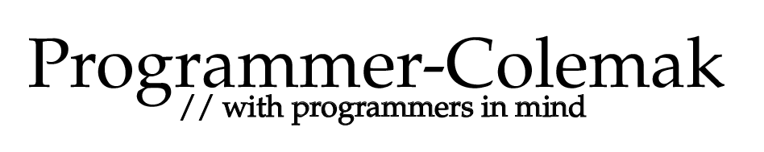
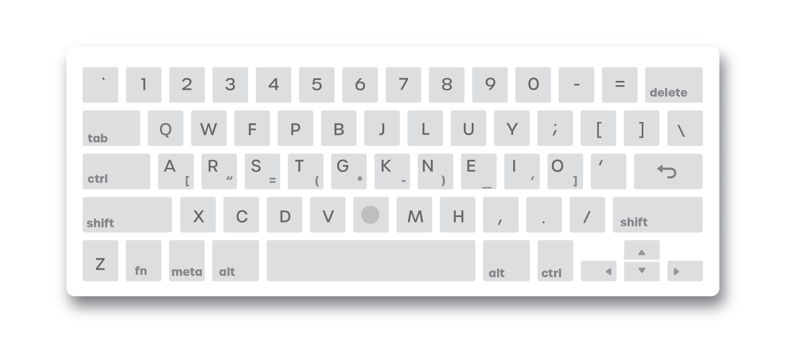

<h1 style="margin-left:-300px">
  </img>
</h1>

# Overview

## Introduction

Programmer-Colemak expands on the [Colemak keyboard](https://colemak.com/) layout by allowing access to frequently used programming symbols on the home row. The layout is inspired by the [Programmer-Dvorak](https://www.kaufmann.no/roland/dvorak/), yet it is very different as it introduces a completely separate modifier for symbols, which replaces the "B" key on traditional qwerty keyboards. The goal of the project is to make programming more ergonomic and enjoyable to type.

## Features

- New modifier on the traditional `B` key, which allows typing of symbols
- `CAPS LOCK` is `CTRL` instead of `BACKSPACE`, due to how often keyboard shortcuts are used
- The left `CTRL` key is now an `ESCAPE` (you're welcome, Vim users)
- On ANSI Keyboards, the `FN` key is replaced by `Z`, and is moved to the location of right `ALT` [(you won't miss the `Z` key)](https://en.wikipedia.org/wiki/Letter_frequency)
- Switch between Programmer-Colemak and Qwerty using `RIGHT CTRL + SHIFT`

# Layout

The layout improves on [Colemak-DH](https://colemakmods.github.io/mod-dh/), a variant of Colemak which moves the "D" and "H" keys to more ergonomic locations, with the modifications above.

</img>

# Usage

Clone this repository or `curl` [aru.ai/keys](http://aru.ai/keys), and place the `programmer-colemak.map` file in a convenient location. Run `xkbcomp programmer-colemak.map $DISPLAY` to enable the layout.
